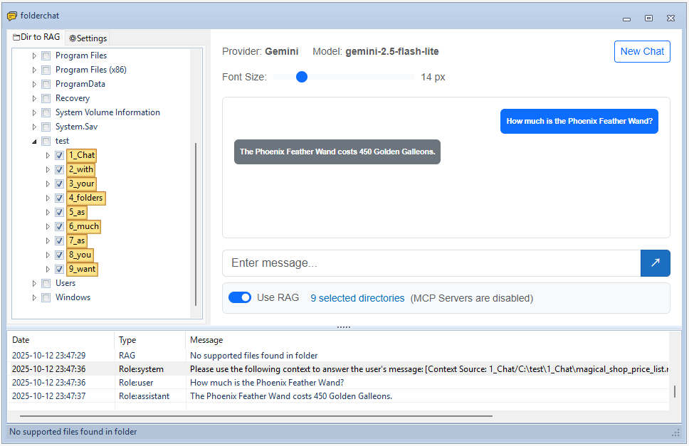

# folderchat - フォルダーとチャットする最も簡単な方法の1つ



folderchatは、Retrieval-Augmented Generation (RAG) 機能を強化したAIチャットインターフェースを提供するWindowsデスクトップアプリケーションです。ローカルドキュメントやフォルダーからの関連コンテキストを提供しながら、AIモデルと会話することができます。

## 機能

- **マルチプロバイダーサポート**: OpenAI互換API、Claude Code CLIなどと連携
- **RAG統合**: 選択したフォルダーからドキュメントを自動的に処理およびインデックス化し、コンテキスト情報を提供
- **MCP (Model Context Protocol) サポート**: MCPサーバーを介してLLMが外部ツールやサービスと対話できるようにする
- **ネイティブ埋め込みサポート**: 外部APIに依存しないオフラインRAG機能のために、ローカル埋め込みモデルサポート (Gemma) を含む
- **Blazor WebView UI**: Windows Formsアプリケーション内の最新のWebベースチャットインターフェース
- **ドキュメント処理**: より良いコンテキスト理解のために、さまざまなドキュメント形式をマークダウンに変換
- **設定可能**: APIエンドポイント、モデル、埋め込み設定などをカスタマイズ
- **フォルダー選択**: 知識ベースに含める特定のディレクトリを選択

## 前提条件

- Windows 10以降
- .NET 9.0 SDK
- Python 3.10以降 (ターゲットPC)
- オプション: uv (uvを使用できますが、pip + requirements.txtもサポートされています)

## インストール

### ソースからのビルド

1. リポジトリをクローンします:
```bash
git clone https://github.com/straygizmo/folderchat.git
cd folderchat
```

2. ソリューションをビルドします:
```bash
dotnet build .\folderchat.sln
```

3. 出力は `folderchat\bin\Debug\net9.0-windows\` にあります。

## 配布用ビルド (Publish)

このプロジェクトは、Windows Formsアプリ内でBlazor WebViewを使用しています。別のマシンで実行可能な配布用ビルドを作成するには、必要なすべてのアセット (wwwrootおよびpython_toolsを含む) が単一のフォルダーにコピーされるようにアプリを公開します。

- ターゲットOS: Windows x64
- フレームワーク: .NET 9.0 (デスクトップ)
- UIランタイム: Microsoft Edge WebView2 (Evergreen)

手順:

1. クリーンして公開
```powershell
dotnet clean
dotnet publish -c Release -r win-x64 --self-contained false
```

2. 公開出力
- 場所: `folderchat/bin/Release/net9.0-windows/win-x64/publish/`
- この `publish` ディレクトリの内容全体をターゲットPCにコピーします (例: `D:\apps\folderchat\`)。

3. ターゲットPCの要件
- .NET 9 Desktop Runtimeをインストールします (`--self-contained false` の場合に必要)
- Edge WebView2 Runtime (Evergreen) がインストールされていることを確認します。不足している場合、アプリは初回実行時にインストールを促すことがあります。

4. 実行
- `publish` フォルダーから `folderchat.exe` を実行します。
- アプリは実行可能ファイルからの相対パスで `wwwroot` からチャットUIをロードします。

5. オプション: 自己完結型ビルド (.NETランタイム不要)
```powershell
dotnet publish -c Release -r win-x64 --self-contained true
```
- より大きな出力フォルダーを生成しますが、ターゲットPCに.NETランタイムをインストールする必要がなくなります。

注意:
- ビルド/公開中に静的Webアセットマニフェストは、他のPCでの絶対パスの問題を避けるために削除されます。`wwwroot` フォルダーは出力にコピーされるため、Blazor WebViewはアプリディレクトリからの相対パスでアセットを解決します。
- `python_tools` フォルダーは、ビルド出力と公開出力の両方に自動的にコピーされます。`python_tools` の下にローカルの `.venv` を公開しないでください (これは除外されます)。ターゲットPCで、次のいずれかの方法でPythonの依存関係を設定します。
  - pip (uvが利用できない場合におすすめ):
    ```
    py -m venv python_tools\.venv
    python_tools\.venv\Scripts\pip install -r python_tools\requirements.txt
    ```
  - uv (オプション):
    ```
    cd python_tools
    uv sync
    ```
  - ポータブルPython (オプション): `python_tools\python.exe` として再配置可能なPythonをバンドルし (例: WinPython)、次に実行します:
    ```
    python_tools\python.exe -m pip install -r python_tools\requirements.txt
    ```
- LLamaSharp CPUネイティブDLLは、重複する公開の競合を避けるために互換性のある `noavx` バリアントを含むように合理化されています。これにより、CPU間の移植性が向上します。AVX固有のビルドの場合、必要に応じてプロジェクト構成を調整してください。

## Pythonツールのセットアップ (必須)

Pythonツールは、ドキュメント処理、チャンク化、および埋め込み機能に**必須**です。folderchatはPythonを次の目的で使用します。
- ドキュメント変換 (MarkItDown)
- テキストのチャンク化と処理
- 埋め込み生成

### セットアップ手順

ターゲットPCでPythonを準備するには、次のいずれかの方法を選択してください。開発PCで作成したローカルの `.venv` を再配布しないでください。

A) pip (uvが利用できない場合におすすめ)
1. `python_tools` 内にvenvを作成します:
   ```bash
   py -m venv python_tools\.venv
   ```
2. 依存関係をインストールします:
   ```bash
   python_tools\.venv\Scripts\pip install -r python_tools\requirements.txt
   ```

B) uv (オプション)
1. `python_tools` ディレクトリに移動します:
   ```bash
   cd python_tools
   ```
2. 依存関係をインストールします:
   ```bash
   uv sync
   ```
注意: uvによって作成された `.venv` はポータブルではありません。他のPCにコピーしないでください。常にターゲットPCで作成してください。

C) ポータブルPython (オプション、システムインストールなし)
1. `python_tools\python.exe` として再配置可能なPythonランタイムをバンドルします (例: WinPython)。
2. そのインタープリターで依存関係をインストールします:
   ```bash
   python_tools\python.exe -m pip install -r python_tools\requirements.txt
   ```

これにより、必要なすべてのPython依存関係がインストールされます。
- ドキュメント変換用のMarkItDown (PDF、DOCXなど)
- テキストチャンク化用のライブラリ
- 埋め込み生成ユーティリティ

**注意**: 適切なPythonツールのセットアップがないと、RAG機能は正しく動作しません。

### APIプロバイダーの設定

folderchatは複数のAPIプロバイダーをサポートしています。

#### OpenAI互換API
- **ベースURL**: APIエンドポイント (例: LM Studioの場合は `http://localhost:1234`)
- **APIキー**: 認証キー
- **モデル**: 使用するモデル (例: `gemma3`)

#### Claude Code CLI
- **CLIパス**: Claude Code実行可能ファイルへのパス
- **モデル**: Claudeモデル識別子

#### GGUFモデル (ローカルチャット)
外部APIなしでローカルGGUFチャットモデルを使用できます。GGUFモデルファイルを次の場所に配置します。
```
python_tools/models/chat/[provider_name]/[modelfile_name].gguf
```

たとえば、[unsloth/gemma-3n-E4B-it-GGUF](https://huggingface.co/unsloth/gemma-3n-E4B-it-GGUF/tree/main) からモデルをダウンロードし、次のように配置します。
```
python_tools/models/chat/unsloth/gemma-3n-E4B-it-Q4_K_M.gguf
```

これにより、LLamaSharpを使用してチャットモデルを完全にオフラインで実行できます。

### 埋め込み設定

RAG機能の場合、埋め込み設定を構成します。
- **埋め込みURL**: 埋め込み生成のエンドポイント (例: LM Studioの場合は `http://localhost:1234`)
- **埋め込みモデル**: 埋め込み用モデル (例: `text-embedding-embeddinggemma-300m`)

#### GGUFモード (ローカル埋め込み)
外部APIなしでローカルGGUF埋め込みモデルを使用できます。Hugging FaceからGGUF埋め込みモデルをダウンロードし、次の場所に配置します。
```
python_tools/models/embedding/[provider_name]/[modelfile_name].gguf
```

たとえば、[unsloth/embeddinggemma-300m-GGUF](https://huggingface.co/unsloth/embeddinggemma-300m-GGUF/tree/main) からモデルをダウンロードし、次のように配置します。
```
python_tools/models/embedding/unsloth/embeddinggemma-300M-Q8_0.gguf
```

これにより、外部APIサービスを必要とせずにローカルで埋め込みを実行できます。

### RAG設定
- **コンテキスト長**: 最大コンテキストウィンドウサイズ
- **チャンクサイズ**: 処理するドキュメントチャンクのサイズ
- **チャンクオーバーラップ**: 連続するチャンク間のオーバーラップ
- **Top K**: コンテキストとして取得する最も関連性の高いドキュメントチャンクの数
- **合計最大コンテキスト長**: 取得されたすべてのコンテキストチャンクの合計最大長

### MCP (Model Context Protocol) 設定

folderchatは、LLMが外部ツールやリソースと対話できるようにするMCPサーバーをサポートしています。MCPサーバーは、ファイルシステムアクセス、API統合、データベース接続などを提供できます。

#### MCPサーバーのセットアップ

1. **MCP設定を開く**: 設定 → MCPサーバー設定に移動します。
2. **MCPサーバーを追加**: 「サーバーを追加」をクリックし、以下を構成します。
   - **名前**: MCPサーバーのわかりやすい名前
   - **トランスポートタイプ**: 次のいずれかを選択します。
     - **stdio**: ローカルプロセスベースのMCPサーバー (最も一般的)
     - **sse**: HTTPベースのMCPサーバー
   - **コマンド/URL**:
     - stdioの場合: MCPサーバーの実行可能ファイルまたはスクリプトへのパス (例: `python`、`node`、`npx`)
     - sseの場合: HTTPエンドポイントURL
   - **引数**: コマンドライン引数 (stdioトランスポートの場合)
   - **環境変数**: サーバー構成のキーと値のペア

3. **サーバーの有効化/無効化**: チェックボックスを使用して、サーバーを削除せずにオン/オフを切り替えます。

#### 例: ファイルシステムMCPサーバー

一般的なユースケースは、LLMがファイルを読み書きできるようにファイルシステムMCPサーバーを設定することです。

```
Name: Filesystem
Transport Type: stdio
Command: npx
Arguments: -y @modelcontextprotocol/server-filesystem C:\path\to\allowed\directory
```

これにより、LLMは指定されたディレクトリ内のファイルを一覧表示、読み取り、書き込みできるようになります。

#### 利用可能なMCPサーバー

多くのMCPサーバーが利用可能です。
- **@modelcontextprotocol/server-filesystem**: ファイルシステム操作
- **@modelcontextprotocol/server-github**: GitHub API統合
- **@modelcontextprotocol/server-sqlite**: SQLiteデータベースアクセス
- **@modelcontextprotocol/server-fetch**: HTTPリクエスト機能
- [MCP SDK](https://github.com/modelcontextprotocol) を使用して構築されたカスタムMCPサーバー

#### 仕組み

MCPが有効な場合:
1. LLMは接続されたMCPサーバーから利用可能なツールに関する情報を受け取ります。
2. LLMがツールを使用する必要がある場合、応答でツール呼び出しを生成します。
3. folderchatはMCPサーバーを介してツールを実行します。
4. ツールの結果はログに記録され (タイプ: "MCP Server")、LLMにフィードバックされます。
5. LLMは結果を使用して最終的な応答を形成します。

**注意**: MCPツールの実行は、アプリケーションのログビューに自動的に記録され、ツール呼び出しとその応答の両方が表示されます。

## 使用方法

1. **アプリケーションを起動**: `folderchat.exe` を実行します。

2. **フォルダーを選択**: 左側のフォルダーツリーを使用して、知識ベースに含めるドキュメントを含むディレクトリを選択します。

3. **ドキュメントを処理**:
   - アプリケーションは、選択したフォルダーからドキュメントを自動的に処理およびインデックス化します。
   - Office/PDFドキュメント (DOCX、XLSX、PPTX、PDF) の場合、MarkItDownはそれらをマークダウン形式に変換し、変換された `.md` ファイルはソースファイルと同じディレクトリに保存されます。
   - 埋め込み後、インデックス化されたドキュメントチャンクを含む `embeddings.jsonl` ファイルがチェックされた各フォルダーに作成されます。

4. **チャットを開始**: チャットインターフェースに質問を入力します。AIは、そのトレーニングとドキュメントからのコンテキストの両方を使用して回答を提供します。

5. **コンテキストを表示**: 「コンテキスト」ボタンをクリックして、現在の会話に使用されているドキュメントチャンクを確認します。

## プロジェクト構造

```
folderchat/
├── folderchat/                 # メインアプリケーションプロジェクト
│   ├── Forms/                  # Windows Forms UIコンポーネント
│   ├── Pages/                  # Blazorコンポーネント
│   ├── Services/               # ビジネスロジックとサービス
│   │   ├── Chat/               # チャットサービスの実装
│   │   ├── Mcp/                # モデルコンテキストプロトコルクライアント (公式SDK)
│   │   ├── IChatService.cs     # チャットサービスインターフェース
│   │   ├── IRagService.cs      # RAGサービスインターフェース
│   │   ├── OpenAIChatService.cs
│   │   ├── ClaudeCodeChatService.cs
│   │   └── RagService.cs       # RAG実装
│   ├── Models/                 # データモデル
│   └── wwwroot/               # BlazorのWebアセット
├── python_tools/              # Pythonユーティリティ
│   ├── main.py                # Pythonツールのメインエントリポイント
│   ├── converter.py           # ドキュメント変換 (MarkItDown統合)
│   ├── document_parser.py     # ドキュメント解析ユーティリティ
│   ├── embeddings.py          # 埋め込み生成
│   ├── indexer.py             # ドキュメントインデックス作成
│   ├── retriever.py           # ドキュメント検索
│   ├── gguf_loader/           # GGUFモデルローディングユーティリティ
│   └── models/                # ローカルモデルストレージ
│       ├── chat/              # チャットモデルディレクトリ
│       │   └── [provider_name]/   # プロバイダー固有のチャットモデル
│       │       └── [model_name].gguf
│       └── embedding/         # 埋め込みモデルディレクトリ
│           └── [provider_name]/   # プロバイダー固有の埋め込みモデル
│               └── [model_name].gguf
└── folderchat.sln             # Visual Studioソリューションファイル
```


## 貢献

貢献を歓迎します！バグや機能リクエストについては、プルリクエストを送信したり、issueを開いたりしてください。

## トラブルシューティング

### よくある問題

1. **API構成が必要です**: 設定で少なくとも1つのAPIプロバイダーを構成していることを確認してください。
2. **ドキュメント処理が失敗する**: 選択したフォルダーにアクセスでき、サポートされているファイル形式が含まれていることを確認してください。
3. **埋め込みエラー**: 埋め込みAPIの資格情報とエンドポイント構成を確認してください。

### ターゲットPCでのRAGインデックス作成エラー: 「... AppData\Roaming\uv\python\cpython-3.13.4-...」で実行可能ファイルが見つかりませんでした
これは、ポータブルではない `.venv` (開発者PCで作成されたもの) がターゲットPCにコピーされ、開発者の `AppData\Roaming\uv\python\...` の下のベースインタープリターを指している場合に発生します。修正:
1. 存在する場合は、`publish` フォルダーから `python_tools\.venv` を削除します (デフォルトでは公開時に除外されます)。
2. 「セットアップ手順」(pip/uv/ポータブル) のいずれかの方法を使用して、ターゲットPCでPythonを準備します。
3. インデックス作成を再実行します。

### サポートされているファイル形式

**テキストファイル:**
- .txt, .md, .csv

**コードファイル:**
- .py, .js, .ts, .jsx, .tsx
- .c, .cpp, .h, .java, .cs
- .go, .rs, .rb, .php
- .swift, .kt, .scala

**構成ファイル:**
- .json, .yaml, .yml
- .toml, .ini, .cfg

**スクリプトファイル:**
- .sh, .bat, .ps1, .sql

**Webファイル:**
- .html, .css, .xml

**Officeドキュメント** (python_toolsが必要):
- .pdf
- .docx, .doc
- .xlsx, .xls
- .pptx, .ppt

## ライセンス

MIT

## 謝辞

- [Blazor WebView](https://docs.microsoft.com/en-us/aspnet/core/blazor/hybrid/) で構築
- [Krypton Toolkit](https://github.com/Krypton-Suite/Standard-Toolkit) のUIコンポーネント
- [OpenAI-DotNet](https://github.com/RageAgainstThePixel/OpenAI-DotNet) を使用したOpenAI統合
- [MarkItDown](https://github.com/microsoft/markitdown) によるドキュメント処理
- [公式C# SDK](https://github.com/modelcontextprotocol/csharp-sdk) を使用したMCP (Model Context Protocol) サポート
